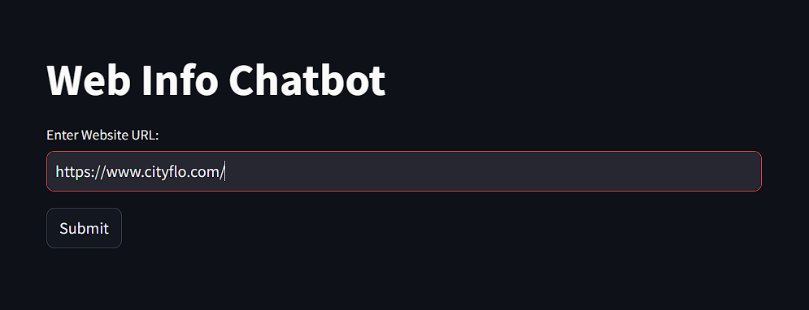
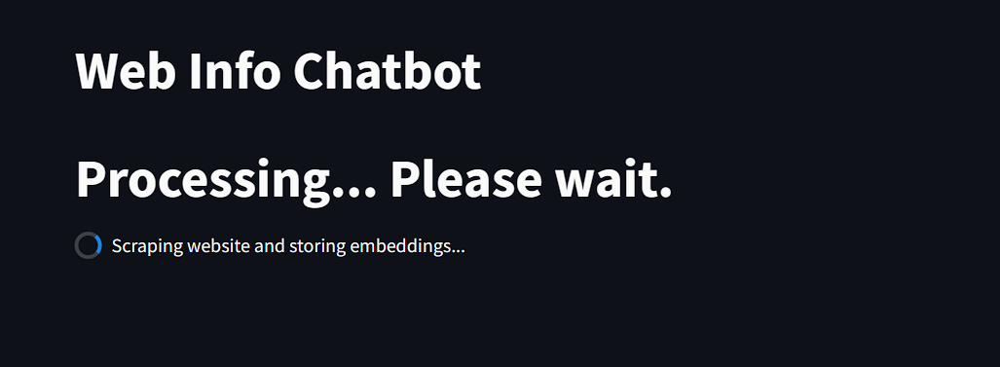
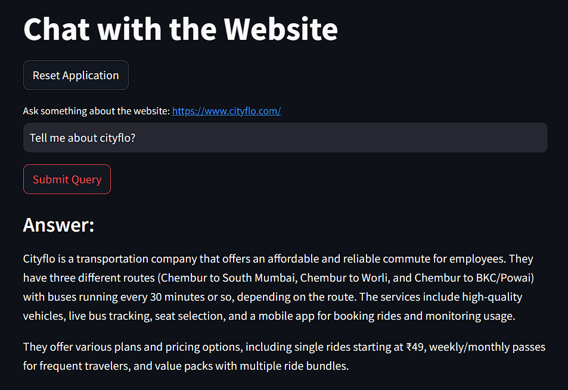
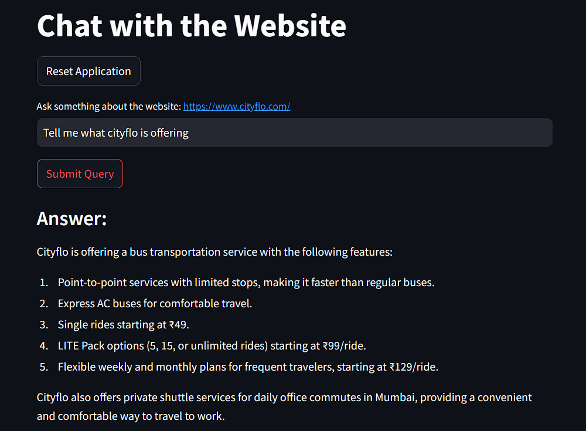

# Web Info Chatbot

## Overview
The **Web Info Chatbot** is a Streamlit-based application that allows users to extract and query information from websites using AI-powered embeddings. The application:
- Scrapes website content, including JavaScript-rendered pages
- Generates text embeddings
- Stores embeddings locally in **FAISS** for efficient similarity search
- Provides a chat interface for querying website information

## Features
- **Website Crawling:** Extracts text from web pages, skipping login/signup pages.
- **JavaScript Support:** Uses Playwright to scrape JavaScript-rendered content.
- **Embeddings Storage:** Uses FAISS to store and retrieve website content efficiently.
- **Chat Interface:** Users can ask questions about the scraped website content.
- **Session Management:** Retains embeddings across interactions and supports reset functionality.

## Technologies Used
- **Python** (Backend)
- **Streamlit** (User Interface)
- **Playwright** (Web Scraping)
- **BeautifulSoup** (HTML Parsing)
- **Ollama Mistral** (Text Embeddings)
- **FAISS** (Vector Database)
- **Asyncio** (Asynchronous Programming)
- **FastAPI** (API)

## Installation
1. **Clone the repository:**
   ```sh
   git clone https://github.com/sidjmishra/Scraper-GPT.git
   cd scraper-gpt
   ```
2. **Create a virtual environment and activate it:**
   ```sh
   python -m venv venv
   source venv/bin/activate   # On Windows use: venv\Scripts\activate
   ```
3. **Install dependencies:**
   ```sh
   pip install -r requirements.txt
   ```
4. **Install Playwright and browsers:**
   ```sh
   playwright install
   ```

## Running the Application
Start the FastAPI application using:
```sh
uvicorn scraper_bot.app:app --port 8000
```

Start the Streamlit application using:
```sh
streamlit run scraper_bot/ui.py
```

## How to Use
1. **Enter a website URL** in the input field and click "Submit".
2. The app will **scrape and process the content**, showing a progress bar.
3. Once completed, a **chat interface** will appear where you can ask questions about the website.
4. Click **"Reset Application"** to clear stored embeddings and restart the process.

## Output Screenshots
Here are some screenshots of the application in action:

### Website Input Page
<p align="center">
  
</p>

### Loading State
<p align="center">
  
</p>

### Chat Interface
<p align="center">
  
</p>
<p align="center">
  
</p>

## Known Issues & Limitations
- May not handle dynamically loaded content fully if it requires user interaction.
- The scraper is limited to a set number of pages (default: 10).
- Works best on text-heavy websites.

## Future Enhancements
- Support for more complex crawling (multi-page navigation based on links).
- Additional filtering options to exclude specific sections of a website.
- Integration with other embedding models.
